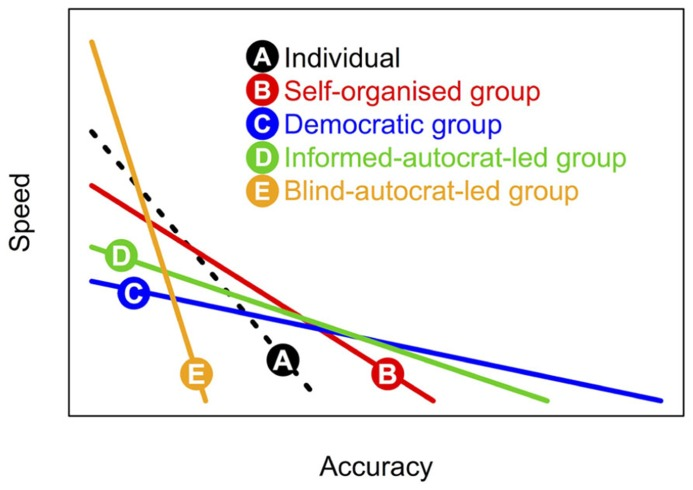

Forget Scrum - You're all Scum
==============================

:tagline: What we can learn from e. Coli and friends
:date: 2017-10-10

As a few of you may know, my background is not just Computer Science. Before I embarked down this track I was a completely different type of scientist. I was a Biochemist.

So today I am going back to my roots and not talking about technology. OK, maybe a little tech will sneak in from time to time.

Consider the *simple* E. coli. No doubt when you spare a thought for this lowly bacteria it is not with much fondness. It is after all one of the most common causes of food poisoning.

But this it no one trick pony.

Most of the time these little bacteria are living the free floating, laid back lifestyle of your average Aussie surf bum. They ride through life by themselves in a liquid medium minding their own business. They can even move themselves around a bit with the aid of little hairs on their surface called cilia.

However, from time to time this little fellow may find itself hang out with it mates and sticking around for a while. It is at this point that the humble E. coli goes full Banana Man, it undergoes a miraculous transformation. It starts making and then releasing an extra-cellular polysaccharide, it start spewing out sugars.

Now despite the laid-back surf dude existence, life is hard as a bacterium. It's a constant battle balancing between using nutrients and find them in the first place. Let alone protecting your patch from interlopers and would be predators. So why, you may ask, would our little friend waste so much energy chucking out something it doesn't use or need?

Well, it will come as no surprise that it doesn't. This sugar it excretes has some interesting properties. I can anchor the bacterium to a surface (like your teeth), it can also help keep it's mates around. And not just it's close mate either. It also help keep around it's more distant relative too. Even those of different species.

So now we have a whole bunch of bacteria sticking together in once place, a biofilm.

The question is why? What's the point. Firstly it offers protection. From the elements, from predators and from annoying things like antibiotics and detergents that those pesky humans keep throwing at it. They become collectively more resilient.

The next function is even more interesting. The individuals are now less concerned about simply surviving. So instead they can do other things. Like specialising. For example, some biofilms have microscopic water channels throughout them that aid in moving around nutrients. They also allow the individuals to share knowledge and gain new skills. In the biological world knowledge is encoded in a manner not dissimilar to our digital one. It's just the form of encoding that changes. Bacteria, like us, use DNA. Biofilms make the exchange of genetic material easier and safer for their inhabitants.

All this sharing and caring between individuals requires something we don't normally associate with single celled organisms. Coordination which in turn requires communication.

Bacteria are still single cells, they don't have the convenience of nervous systems like we do to facilitate high speed communication. Instead they kick it old school. They release signalling molecules (pheromones).

Concentration Gradients
-----------------------

To help you understand how this kind of signalling works, I'm going to take a short aside into concentration gradients

.. code-block:: none

                +-------------------------------+
                |                     oo        |
    Outer Edge  |            o        oooo      | Core
                |    o       oo       oooooo    |
                +-------------------------------+

    Low Conc.   --------------------------------> High Conc.

In the diagram above you can see a slice through a biofilm. You can see that as you get closer to the core, the are move individuals. If all the individuals are releasing a small amount of this signalling molecule, it stands to reason that the closer you get to the core, the higher the concentration.

So how is this useful? This simplest use is as a trigger that changes behaviour (e.g. turns on a certain gene). Those at the outer edge have a very low concentration of the signalling molecule, and therefore don't change their behaviour. As we move towards the core, the concentration increase until we hit a trigger point. So the closer we move to the core, the higher the change of a behavioural change.

We now have an example of a de-centralised system of decision making based on population density.

You can take this mechanism in a few different directions to create a more complex decision making progress. For example we could have multiple trigger points at various concentration levels. Each one triggering a different behaviour - this is how embryos know head from tail. Or what about if the basis wasn't just population but that the signal is released only during certain events. Like the detection of an anti-biotic, thus giving those individuals not yet effected a chance spin up their defences.

This kind of population based co-ordination is called Quorum Sensing and is one of the key mechanisms that trigger biofilm production.

Now that's probably more than you ever wanted to know about bacteria, and you are all probably wondering what on earth I am on about.

What this all points to in a somewhat round about way is that agile, scrum and the likes got something more right that perhaps they know. Biofilms and the mechanisms that helps them form are an excellent example of self-organising teams. They respond and adjust to the needs and challenges of individuals as event happen. They support and encourage each other to be more than just individuals. The whole is greater than the sum of it's parts.

This is how I like think about self-organising teams. Though the sharing of informations, the encouragement of individuals and the celebration of each little achievement we all become more resilient, more productive and more accurate.

Ok, one more little aside into *science*.

Speed vs Accuracy
-----------------

Different mechanisms of decision making have different trade-offs. The most obvious is speed vs. accuracy. At one of the scale you have blind-autocratic leadership (do what I say). This is obviously super fast but is pretty crappy when it comes to accuracy.  At the opposite end of the scale with have a truly democratic group where all information from all individuals is considered. This obviously takes time, but has the highest accuracy.

Right slap-bang in the middle are self-organising groups. They are more accurate than individuals, but only slightly slower. Therefore making a good compromise between going fast and hitting targets. The article [1]_ that this diagram came from makes for pretty good reading in general about collective decision making and self organising groups.

Wrapping Up
-----------

What I want you to take away from this talk is not just a bunch of obscure microbiology, but 2 key things. Life is all about self-organising, self-regulating groups. Bacteria have been doing this stuff for longer than humans have even existed, we just, arguably, do it better. Ask me some time about Endosymbiosis, and some of my pet theories on evolution if you haven't got anything better to do.

The second is that we all have different backgrounds and interests. This is valuable, a strength and that we can all draw inspirations from this in our day to day working lives. From the perhaps more obviously applicable backgrounds of Mathematics, to slightly less obvious Psychology on to the more distant sciences, music, and beyond. Embracing our differences and working together as a collective makes us more than the sum of our parts. We should all aspire to becoming pond scum.

References
----------

.. [1] Ross-Gillespie A, Kümmerli R. Collective decision-making in microbes. Frontiers in Microbiology.
       2014;5:54. doi:10.3389/fmicb.2014.00054. https://www.ncbi.nlm.nih.gov/pmc/articles/PMC3939447/
